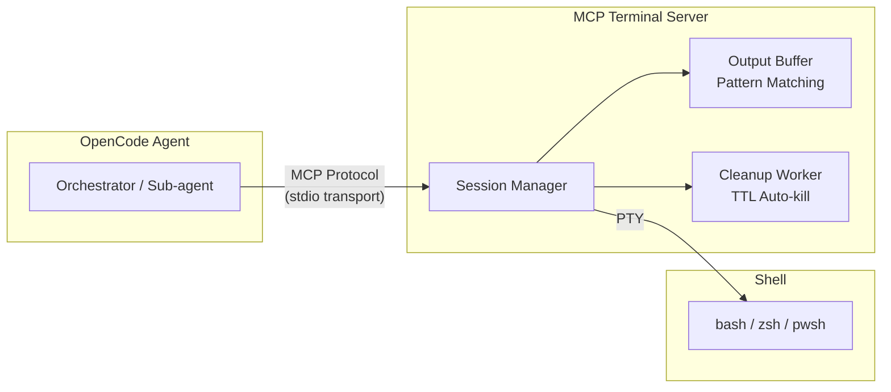
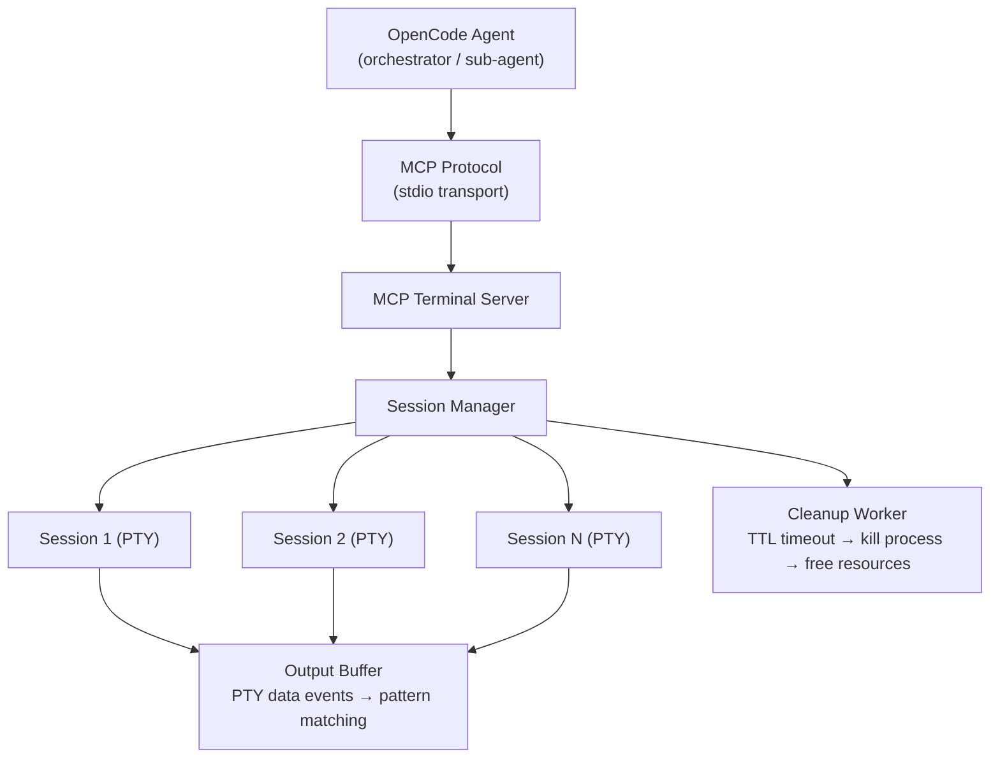

# MCP Terminal Server


[](https://spec.modelcontextprotocol.io)
[](https://github.com/microsoft/node-pty)


[](https://www.npmjs.com/package/mcp-terminal-server)

> **An MCP Server that exposes a real interactive terminal (PTY) as tools that AI agents can use to execute interactive commands.**

---

## The Problem

Terminal tools in AI platforms (OpenCode, Claude Code, etc.) run commands in a **one-shot non-interactive** mode:

```
bash("npm init")  →  timeout ❌  (npm init is waiting for user input)
```

- No real TTY, no persistent session, no open stdin
- When `npm init`, `gh pr create`, `npx create-vite`, `psql` are waiting for user input, the agent **gets stuck**
- Sub-agents suffer even more because they have fewer tools available

## The Solution

An **MCP Server** that exposes a real pseudo-terminal (PTY) as MCP tools. The agent can create a session, write commands, read output until a pattern appears, and respond — **just like a human using a terminal**.



## MCP Tools

### 1. `terminal_create_session`

Creates a new interactive terminal session.

| Parameter | Type     | Default  | Description                                 |
| --------- | -------- | -------- | ------------------------------------------- |
| `id`      | `string` | UUID     | Custom session ID                           |
| `shell`   | `string` | `"auto"` | Shell: `auto`, `bash`, `zsh`, `pwsh`, `cmd` |
| `cwd`     | `string` | `cwd`    | Working directory                           |
| `cols`    | `number` | `80`     | Terminal columns                            |
| `rows`    | `number` | `24`     | Terminal rows                               |
| `env`     | `object` | `{}`     | Additional environment variables            |

### 2. `terminal_write`

Writes text/keystrokes to the terminal.

| Parameter | Type     | Description                                       |
| --------- | -------- | ------------------------------------------------- |
| `id`      | `string` | Session ID                                        |
| `data`    | `string` | Data to write (`\n` for Enter, `\x03` for Ctrl+C) |

### 3. `terminal_read`

Reads the current terminal buffer contents. Non-blocking — returns whatever output has accumulated.

| Parameter | Type      | Default | Description                                |
| --------- | --------- | ------- | ------------------------------------------ |
| `id`      | `string`  | —       | Session ID                                 |
| `flush`   | `boolean` | `false` | If `true`, clears the buffer after reading |

### 4. `terminal_read_until` ⭐

**The most important tool.** Reads the terminal buffer until a regex pattern matches or the timeout is reached.

| Parameter    | Type      | Default | Description                                     |
| ------------ | --------- | ------- | ----------------------------------------------- |
| `id`         | `string`  | —       | Session ID                                      |
| `pattern`    | `string`  | —       | Regex pattern to wait for                       |
| `timeout_ms` | `number`  | `30000` | Maximum wait time in milliseconds               |
| `strip_ansi` | `boolean` | `false` | If `true`, strips ANSI escape codes from output |

### 5. `terminal_resize`

Resizes the terminal dimensions.

| Parameter | Type     | Description      |
| --------- | -------- | ---------------- |
| `id`      | `string` | Session ID       |
| `cols`    | `number` | New column count |
| `rows`    | `number` | New row count    |

### 6. `terminal_list_sessions`

Lists all active terminal sessions.

| Parameter | Type      | Default | Description                           |
| --------- | --------- | ------- | ------------------------------------- |
| `verbose` | `boolean` | `false` | Includes the last activity timestamps |

### 7. `terminal_send_signal`

Sends a POSIX signal to the foreground process in the terminal. More explicit and reliable than writing `\x03` (Ctrl+C) as raw bytes.

| Parameter | Type     | Description                                          |
| --------- | -------- | ---------------------------------------------------- |
| `id`      | `string` | Session ID                                           |
| `signal`  | `string` | Signal: `SIGINT`, `SIGTSTP`, `SIGQUIT`, or `SIGKILL` |

### 8. `terminal_ping`

Health check endpoint. Returns server status, active session count, and uptime.

| Parameter | Type | Description |
| --------- | ---- | ----------- |

### 9. `terminal_tail`

Reads the last N lines of the terminal buffer (like `tail -n N`). Token-efficient — avoids paying tokens for old accumulated output.

| Parameter | Type     | Default | Description                      |
| --------- | -------- | ------- | -------------------------------- |
| `id`      | `string` | —       | Session ID                       |
| `lines`   | `number` | `20`    | Number of recent lines to return |

### 10. `terminal_screenshot`

Takes a screenshot of the current terminal screen. Returns clean, rendered text rows with cursor position — no raw ANSI codes.

| Parameter | Type     | Description |
| --------- | -------- | ----------- |
| `id`      | `string` | Session ID  |

### 11. `terminal_close_session`

Closes a terminal session and frees its resources.

| Parameter | Type      | Default | Description                     |
| --------- | --------- | ------- | ------------------------------- |
| `id`      | `string`  | —       | Session ID                      |
| `force`   | `boolean` | `false` | Immediate termination (SIGKILL) |

## Examples

### `npm init`

```bash
// 1. Create session
→ terminal_create_session({ "cwd": "/project" })
← { "id": "sess-1" }

// 2. Execute command
→ terminal_write({ "id": "sess-1", "data": "npm init\n" })

// 3. Wait for prompt
→ terminal_read_until({ "id": "sess-1", "pattern": "package name:", "timeout_ms": 10000 })
← { "data": "package name: (my-project) ", "matched": "package name:" }

// 4. Respond
→ terminal_write({ "id": "sess-1", "data": "my-awesome-project\n" })

// 5. Wait for next prompt
→ terminal_read_until({ "id": "sess-1", "pattern": "version:|entry point:", "timeout_ms": 10000 })
← { "data": "version: (1.0.0) ", "matched": "version:" }

// 6. Accept default
→ terminal_write({ "id": "sess-1", "data": "\n" })

// ... repeat until done ...

// N. Close session
→ terminal_close_session({ "id": "sess-1" })
```

### `npx create-vite` with selection

```bash
→ terminal_create_session({ "cwd": "/projects" })
→ terminal_write({ "id": "sess-1", "data": "npm create vite@latest\n" })
→ terminal_read_until({ "id": "sess-1", "pattern": "Project name:" })
→ terminal_write({ "id": "sess-1", "data": "my-app\n" })
→ terminal_read_until({ "id": "sess-1", "pattern": "Select a framework:" })
→ terminal_write({ "id": "sess-1", "data": "React\n" })
→ terminal_read_until({ "id": "sess-1", "pattern": "Select a variant:" })
→ terminal_write({ "id": "sess-1", "data": "TypeScript\n" })
→ terminal_read_until({ "id": "sess-1", "pattern": "Done|\\$ ", "timeout_ms": 30000 })
→ terminal_close_session({ "id": "sess-1" })
```

### `gh pr create`

```bash
→ terminal_create_session({ "cwd": "/repos/my-app" })
→ terminal_write({ "id": "sess-1", "data": "gh pr create --fill\n" })
→ terminal_read_until({ "id": "sess-1", "pattern": "Submit|What", "timeout_ms": 15000 })
// Agent analyzes and decides response
→ terminal_write({ "id": "sess-1", "data": "\n" })
→ terminal_read_until({ "id": "sess-1", "pattern": "https://github.com|Error|\\$ ", "timeout_ms": 20000 })
→ terminal_close_session({ "id": "sess-1" })
```

## Installation

```bash
# Run directly (no install needed)
npx mcp-terminal-server

# Or install globally
npm install -g mcp-terminal-server
```

### Quick Setup

```bash
# 1. Configure MCP in opencode.json (project or global)
mcp-terminal-server setup

# 2. Install the interactive-terminal skill for AI agents
mcp-terminal-server install-skills

# 3. Start the MCP server (stdio transport)
mcp-terminal-server
```

The `setup` command **always asks** which config to update:

```
$ npx mcp-terminal-server setup

Which opencode.json do you want to configure?
  [p] Project  — /home/user/project/opencode.json
  [g] Global   — ~/.config/opencode/opencode.json

Choose [p/g]:
```

### Prerequisites

- **Node.js 22+** (required for `crypto.randomUUID()`)
- **Native compilation**: `node-pty` requires build tools:
  - **Windows**: Visual Studio Build Tools or MSVC
  - **Linux**: `make`, `gcc`, `python3`
  - **macOS**: Xcode Command Line Tools

## OpenCode Configuration

If you prefer to configure manually, add this to your `opencode.json`:

```json
{
  "mcp": {
    "terminal": {
      "command": ["npx", "mcp-terminal-server"],
      "type": "local",
      "enabled": true
    }
  }
}
```

### Environment Variables

| Variable                      | Default           | Description                             |
| ----------------------------- | ----------------- | --------------------------------------- |
| `MCP_TERMINAL_MAX_SESSIONS`   | `10`              | Maximum number of simultaneous sessions |
| `MCP_TERMINAL_SESSION_TTL_MS` | `1800000` (30min) | Session inactivity TTL                  |

## Architecture



### Components

| Component          | File                     | Responsibility                                                                                                 |
| ------------------ | ------------------------ | -------------------------------------------------------------------------------------------------------------- |
| **OutputBuffer**   | `src/output-buffer.ts`   | Circular buffer with regex pattern matching. Accumulates PTY data and enables `readUntil()` with 50ms polling. |
| **PTYSession**     | `src/pty-session.ts`     | Wraps `node-pty`. Connects the OutputBuffer to the real shell process.                                         |
| **SessionManager** | `src/session-manager.ts` | Manages session lifecycle: creation, listing, closing, automatic TTL cleanup.                                  |
| **MCPServer**      | `src/server.ts`          | Exposes 11 tools via the MCP protocol. Handles errors and input validation.                                    |
| **ShellDetector**  | `src/shell-detector.ts`  | Detects the preferred shell per platform (auto/bash/zsh/pwsh/cmd).                                             |
| **AnsiStripper**   | `src/ansi-stripper.ts`   | Strips ANSI escape codes from terminal output.                                                                 |

## Development

```bash
# Clone and install
git clone https://github.com/mmartinrm97/mcp-terminal-server
cd mcp-terminal-server
pnpm install

# Build
pnpm build

# Tests
pnpm test            # All tests (unit + integration)
pnpm test:unit       # Unit tests only
pnpm test:int        # Integration tests only
pnpm test:watch      # Watch mode

# Type checking
pnpm tsc --noEmit
```

### Tests

The project uses [vitest](https://vitest.dev/) with **Strict TDD Mode**:

```
pnpm test
  ✓ test/unit/ansi-stripper.test.ts              (9 tests)
  ✓ test/unit/index.test.ts                      (6 tests)
  ✓ test/unit/output-buffer.test.ts              (19 tests)
  ✓ test/unit/pty-session.test.ts                (19 tests)
  ✓ test/unit/server.test.ts                     (37 tests)
  ✓ test/unit/session-manager.test.ts            (14 tests)
  ✓ test/unit/shell-detector.test.ts             (8 tests)
  ✓ test/unit/types.test.ts                      (8 tests)
  ✓ test/unit/utils.test.ts                      (26 tests)
  ✓ test/unit/screen.test.ts                     (15 tests)
  ✓ test/integration/pty-session.int.test.ts     (15 tests)
  ✓ test/integration/session-manager.int.test.ts (8 tests)
  ✓ test/integration/executables.int.test.ts     (8 tests)
  ✓ test/integration/mcp-server.int.test.ts      (11 tests)

 Test Files  14 passed (14)
      Tests  203 passed (203)
```

## Security

1. **Agent input**: The agent writes directly to the PTY. If the agent issues `rm -rf /`, the command executes — the server does not filter commands because the agent acts on behalf of the user.
2. **Global timeout**: Each session has a maximum TTL (default: 30 minutes of inactivity).
3. **Session limit**: Maximum N simultaneous sessions (configurable, default: 10).
4. **Orphan cleanup**: If the MCP server process dies, child PTY processes are cleaned up automatically.
5. **No secrets**: The server MUST NOT be used for sensitive input (passwords, tokens) because the intermediary agent sees everything.

## Roadmap

- [x] Core: OutputBuffer, PTYSession, SessionManager
- [x] MCP Server with 11 tools
- [x] Agent skill (`interactive-terminal`) for OpenCode agents
- [x] npm publishing (v0.1.2+)
- [x] Unit tests (161 tests)
- [x] Integration tests with real executables (42 tests)
- [ ] SSE transport for remote connections

## Contributing

See [CONTRIBUTING.md](./CONTRIBUTING.md) for development setup, coding guidelines, and pull request process.

## Changelog

See [CHANGELOG.md](./CHANGELOG.md) for version history and release notes.

## Roadmap

See [ROADMAP.md](./ROADMAP.md) for planned features, platform support, and future milestones.

## License

Distributed under the MIT License. See [LICENSE](./LICENSE) for more information.
