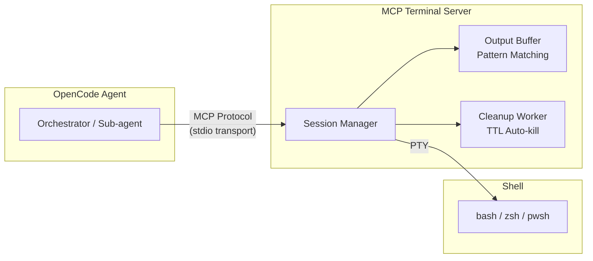
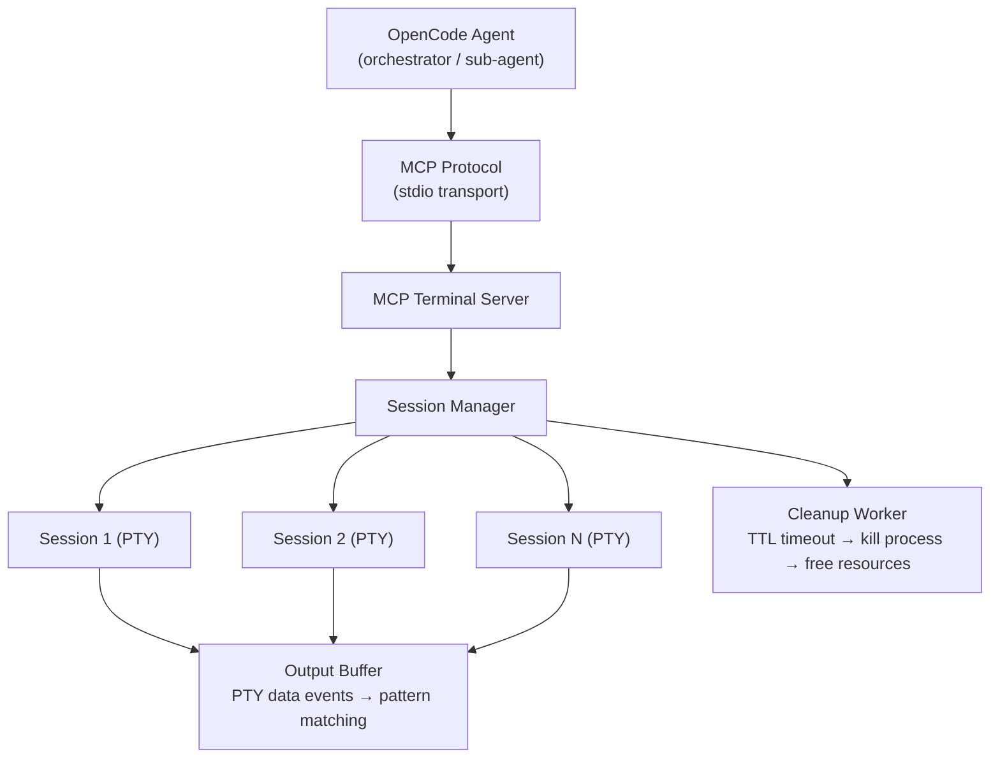

# terminalize

<p align="center">
  
</p>

<p align="center">
  <a href="https://www.npmjs.com/package/terminalize"></a>
  
  
  
  
  
  
</p>

> **Interactive terminal sessions for AI agents over MCP.**
>
> Give your agents a persistent terminal they can actually talk to:
>
> - real PTY sessions
> - prompt-aware reads and semantic screenshots
> - verified interactive flows like `npm init`, `gh pr create`, `create-vite`, and `psql`

[](https://spec.modelcontextprotocol.io)
[](https://github.com/microsoft/node-pty)
[](https://www.npmjs.com/package/terminalize)
[](./docs/COMPATIBILITY.md)
[](./docs/COMPATIBILITY.md)
[](./docs/COMPATIBILITY.md)
[](./docs/COMPATIBILITY.md)
[](./docs/COMPATIBILITY.md)

> **Stop the "one-shot" guessing game. Give your AI agents a persistent terminal they can actually talk to.**

---

## The Problem

Terminal tools in AI platforms (OpenCode, Claude Code, etc.) run commands in a **one-shot non-interactive** mode:

```
bash("npm init")  →  timeout ❌  (npm init is waiting for user input)
```

- No real TTY, no persistent session, no open stdin
- When `npm init`, `gh pr create`, `npx create-vite`, `psql` are waiting for user input, the agent **gets stuck**
- Sub-agents suffer even more because they have fewer tools available

## The Solution

An **MCP Server** that exposes a real pseudo-terminal (PTY) as MCP tools. The agent can create a session, write commands, read output until a pattern appears, and respond — **just like a human using a terminal**.


<details>
<summary>Diagram source (Mermaid)</summary>



</details>

## Installation

```bash
# Run directly (no install needed)
npx terminalize

# Or install globally
npm install -g terminalize
```

### Quick Setup

```bash
# 1. Install the terminalize skill for AI agents
npx terminalize install-skills

# 2. Follow your agent-specific installation guide

# 3. Start the MCP server in your project
npx terminalize
```

The `install-skills` command asks whether to install at the project or global level, then lets you select which agents to configure:

```
$ npx terminalize install-skills

◇  Install skills at project level or globally?
│  ● Project   → .agents/skills/ — only this project
│  ○ Global    → ~/.agent/skills/ — all projects

◇  Which agents do you want to install the skill for?
│  ◻ Universal (.agents/skills)
│  ◻ Claude Code
│  ◻ Kiro CLI
```

### Agent-specific setup

Use the dedicated install guides:

- [Installation guides index](./docs/installation-guides/README.md)
- [Antigravity CLI](./docs/installation-guides/install-antigravity.md)
- [Claude Code](./docs/installation-guides/install-claude.md)
- [Cursor](./docs/installation-guides/install-cursor.md)
- [GitHub Copilot CLI](./docs/installation-guides/install-copilot.md)
- [Kiro CLI](./docs/installation-guides/install-kiro.md)
- [OpenAI Codex](./docs/installation-guides/install-codex.md)
- [OpenCode](./docs/installation-guides/install-opencode.md)
- [Pi](./docs/installation-guides/install-pi.md)

The root README intentionally does **not** duplicate every host-specific MCP block anymore. Those details live in the per-agent guides.

### Prerequisites

- **Node.js 22+** (required for `crypto.randomUUID()`)
- **Native compilation**: `node-pty` requires build tools:
  - **Windows**: Visual Studio Build Tools or MSVC
  - **Linux**: `make`, `gcc`, `python3`
  - **macOS**: Xcode Command Line Tools

### Environment Variables

| Variable                               | Default           | Description                                        |
| -------------------------------------- | ----------------- | -------------------------------------------------- |
| `MCP_TERMINAL_MAX_SESSIONS`            | `10`              | Maximum number of simultaneous sessions            |
| `MCP_TERMINAL_SESSION_TTL_MS`          | `1800000` (30min) | Session inactivity TTL                             |
| `MCP_TERMINAL_SESSION_MAX_DURATION_MS` | unset             | Optional hard cap for total session lifetime       |
| `MCP_TERMINAL_OUTPUT_BUFFER_MAX_BYTES` | `1048576` (1MB)   | Maximum retained PTY output bytes per session      |
| `MCP_TERMINAL_ALLOWED_CWD_ROOTS`       | `process.cwd()`   | Optional `;`-separated allowed cwd roots           |
| `MCP_TERMINAL_COMMAND_ALLOW_PATTERNS`  | empty             | Optional `;;`-separated regex allowlist for writes |
| `MCP_TERMINAL_COMMAND_DENY_PATTERNS`   | empty             | Optional `;;`-separated regex denylist for writes  |

## MCP Tools

### 1. `terminal_create_session`

Creates a new interactive terminal session.

| Parameter | Type     | Default  | Description                                 |
| --------- | -------- | -------- | ------------------------------------------- |
| `id`      | `string` | UUID     | Custom session ID                           |
| `shell`   | `string` | `"auto"` | Shell: `auto`, `bash`, `zsh`, `pwsh`, `cmd` |
| `cwd`     | `string` | `cwd`    | Working directory                           |
| `cols`    | `number` | `80`     | Terminal columns                            |
| `rows`    | `number` | `24`     | Terminal rows                               |
| `env`     | `object` | `{}`     | Additional environment variables            |

### 2. `terminal_write`

Writes text/keystrokes to the terminal.

| Parameter | Type     | Description                                       |
| --------- | -------- | ------------------------------------------------- |
| `id`      | `string` | Session ID                                        |
| `data`    | `string` | Data to write (`\n` for Enter, `\x03` for Ctrl+C) |

**Tip**: For commands where you need to know exactly when they finish, combine with `terminal_read_until` and use the `writeMarked` method internally (enabled by default via the agent skill). It wraps commands with unique completion markers (`__TERM_MARK_<hex>__`) so the agent can wait for a deterministic pattern instead of guessing the prompt.

### 3. `terminal_read`

Reads the current terminal buffer contents. Non-blocking — returns whatever output has accumulated.

| Parameter | Type      | Default | Description                                                                                                                                     |
| --------- | --------- | ------- | ----------------------------------------------------------------------------------------------------------------------------------------------- |
| `id`      | `string`  | —       | Session ID                                                                                                                                      |
| `flush`   | `boolean` | `false` | If `true`, clears the buffer after reading                                                                                                      |
| `since`   | `number`  | —       | Byte position for incremental reads. Returns only output after this position. Use `position` from previous response for token-efficient polling |

Response includes `position` (monotonic byte counter) for use in subsequent `since` reads.

### 4. `terminal_read_until` ⭐

**The most important tool.** Reads the terminal buffer until a regex pattern matches or the timeout is reached.

| Parameter    | Type      | Default | Description                                     |
| ------------ | --------- | ------- | ----------------------------------------------- |
| `id`         | `string`  | —       | Session ID                                      |
| `pattern`    | `string`  | —       | Regex pattern to wait for                       |
| `timeout_ms` | `number`  | `30000` | Maximum wait time in milliseconds               |
| `strip_ansi` | `boolean` | `false` | If `true`, strips ANSI escape codes from output |

### 5. `terminal_resize`

Resizes the terminal dimensions.

| Parameter | Type     | Description      |
| --------- | -------- | ---------------- |
| `id`      | `string` | Session ID       |
| `cols`    | `number` | New column count |
| `rows`    | `number` | New row count    |

### 6. `terminal_list_sessions`

Lists all active terminal sessions.

| Parameter | Type      | Default | Description                           |
| --------- | --------- | ------- | ------------------------------------- |
| `verbose` | `boolean` | `false` | Includes the last activity timestamps |

### 7. `terminal_send_signal`

Sends a POSIX signal to the foreground process in the terminal. More explicit and reliable than writing `\x03` (Ctrl+C) as raw bytes.

| Parameter | Type     | Description                                          |
| --------- | -------- | ---------------------------------------------------- |
| `id`      | `string` | Session ID                                           |
| `signal`  | `string` | Signal: `SIGINT`, `SIGTSTP`, `SIGQUIT`, or `SIGKILL` |

### 8. `terminal_ping`

Health check endpoint. Returns server status, active session count, and uptime.

| Parameter | Type | Description |
| --------- | ---- | ----------- |

### 9. `terminal_tail`

Reads the last N lines of the terminal buffer (like `tail -n N`). Token-efficient — avoids paying tokens for old accumulated output.

| Parameter | Type     | Default | Description                      |
| --------- | -------- | ------- | -------------------------------- |
| `id`      | `string` | —       | Session ID                       |
| `lines`   | `number` | `20`    | Number of recent lines to return |

### 10. `terminal_screenshot`

Takes a screenshot of the current terminal screen. Returns clean, rendered text rows with cursor position — no raw ANSI codes.

Also includes best-effort semantic hints for agents:

- `terminal_mode`
- `editor_mode`
- `status_line`
- `content_rows`
- `detectedPrompt`
- `promptCategory`
- `shouldAskUser`
- `askUserReason`
- `canAcceptDefault`
- `isInteractive`
- `recommendedNextAction`
- `idleMs`
- `outputBytes`

Typical interpretation:

- `recommendedNextAction = "input_required"` → the terminal is waiting for an answer
- `recommendedNextAction = "ask_user"` → do **not** guess; escalate to the user
- `canAcceptDefault = true` → pressing Enter is likely safe for this prompt

| Parameter | Type     | Description |
| --------- | -------- | ----------- |
| `id`      | `string` | Session ID  |

### 11. `terminal_close_session`

Closes a terminal session and frees its resources.

| Parameter | Type      | Default | Description                     |
| --------- | --------- | ------- | ------------------------------- |
| `id`      | `string`  | —       | Session ID                      |
| `force`   | `boolean` | `false` | Immediate termination (SIGKILL) |

### 12. `terminal_session_diagnostics`

Returns a structured diagnostics snapshot for a session.

Use this when an interactive flow behaved unexpectedly and you need to know:

- what the session metadata looks like
- what recent reads/writes/timeouts happened
- what the latest semantic screen state looks like

| Parameter     | Type     | Default | Description                               |
| ------------- | -------- | ------- | ----------------------------------------- |
| `id`          | `string` | —       | Session ID                                |
| `event_limit` | `number` | `50`    | Maximum number of recent events to return |

### 13. `terminal_session_export`

Returns a structured export payload for issue reports and failure replay.

This includes:

- session metadata
- recent timeline events
- latest semantic screenshot
- replay-friendly transcript derived from inputs, outputs, waits, signals, and lifecycle events

| Parameter     | Type     | Default | Description                                      |
| ------------- | -------- | ------- | ------------------------------------------------ |
| `id`          | `string` | —       | Session ID                                       |
| `event_limit` | `number` | `50`    | Maximum number of recent events/transcript items |

## Examples

### `npm init`

```bash
// 1. Create session
→ terminal_create_session({ "cwd": "/project" })
← { "id": "sess-1" }

// 2. Execute command
→ terminal_write({ "id": "sess-1", "data": "npm init\n" })

// 3. Wait for prompt
→ terminal_read_until({ "id": "sess-1", "pattern": "package name:", "timeout_ms": 10000 })
← { "data": "package name: (my-project) ", "matched": "package name:" }

// 4. Respond
→ terminal_write({ "id": "sess-1", "data": "my-awesome-project\n" })

// 5. Wait for next prompt
→ terminal_read_until({ "id": "sess-1", "pattern": "version:|entry point:", "timeout_ms": 10000 })
← { "data": "version: (1.0.0) ", "matched": "version:" }

// 6. Accept default
→ terminal_write({ "id": "sess-1", "data": "\n" })

// IMPORTANT: wait for the NEXT prompt before writing again
// Do NOT send multiple Enters in a batch to "skip ahead"

// If screenshot/recommendedNextAction says "ask_user",
// stop and ask the human instead of guessing.

// ... repeat until done ...

// N. Close session
→ terminal_close_session({ "id": "sess-1" })
```

### `npx create-vite` with selection

```bash
→ terminal_create_session({ "cwd": "/projects" })
→ terminal_write({ "id": "sess-1", "data": "npm create vite@latest\n" })
→ terminal_read_until({ "id": "sess-1", "pattern": "Project name:" })
→ terminal_write({ "id": "sess-1", "data": "my-app\n" })
→ terminal_read_until({ "id": "sess-1", "pattern": "Select a framework:" })
→ terminal_write({ "id": "sess-1", "data": "React\n" })
→ terminal_read_until({ "id": "sess-1", "pattern": "Select a variant:" })
→ terminal_write({ "id": "sess-1", "data": "TypeScript\n" })
→ terminal_read_until({ "id": "sess-1", "pattern": "Done|\\$ ", "timeout_ms": 30000 })
→ terminal_close_session({ "id": "sess-1" })
```

### `gh pr create`

```bash
→ terminal_create_session({ "cwd": "/repos/my-app" })
→ terminal_write({ "id": "sess-1", "data": "gh pr create --fill\n" })
→ terminal_read_until({ "id": "sess-1", "pattern": "Submit|What", "timeout_ms": 15000 })
// Agent analyzes and decides response
→ terminal_write({ "id": "sess-1", "data": "\n" })
→ terminal_read_until({ "id": "sess-1", "pattern": "https://github.com|Error|\\$ ", "timeout_ms": 20000 })
→ terminal_close_session({ "id": "sess-1" })
```

## Architecture


<details>
<summary>Diagram source (Mermaid)</summary>



</details>

### Components

| Component          | File                                   | Responsibility                                                                                                 |
| ------------------ | -------------------------------------- | -------------------------------------------------------------------------------------------------------------- |
| **OutputBuffer**   | `src/core/output-buffer.ts`            | Circular buffer with regex pattern matching. Accumulates PTY data and enables `readUntil()` with 50ms polling. |
| **PTYSession**     | `src/core/pty-session.ts`              | Wraps `node-pty`. Connects the OutputBuffer to the real shell process.                                         |
| **SessionManager** | `src/core/session-manager.ts`          | Manages session lifecycle: creation, listing, closing, automatic TTL cleanup.                                  |
| **TerminalServer** | `src/server/create-terminal-server.ts` | Wires the MCP server, tool definitions, and resource handlers together.                                        |
| **ServerFacade**   | `src/server.ts`                        | Stable public export surface for the modular server implementation.                                            |
| **ShellDetector**  | `src/lib/shell-detector.ts`            | Detects the preferred shell per platform (auto/bash/zsh/pwsh/cmd).                                             |
| **AnsiStripper**   | `src/lib/ansi-stripper.ts`             | Strips ANSI escape codes from terminal output.                                                                 |

## Development

```bash
# Clone and install
git clone https://github.com/mmartinrm97/terminalize
cd terminalize
pnpm install

# Build
pnpm build

# Tests
pnpm test            # All tests (unit + integration)
pnpm test:unit       # Unit tests only
pnpm test:int        # Integration tests only
pnpm test:watch      # Watch mode

# Type checking
pnpm tsc --noEmit
```

### Tests

The project uses [vitest](https://vitest.dev/) with **Strict TDD Mode**:

```
pnpm test
  ✓ test/unit/ansi-stripper.test.ts              (9 tests)
  ✓ test/unit/index.test.ts                      (6 tests)
  ✓ test/unit/output-buffer.test.ts              (19 tests)
  ✓ test/unit/pty-session.test.ts                (19 tests)
  ✓ test/unit/server.test.ts                     (37 tests)
  ✓ test/unit/session-manager.test.ts            (14 tests)
  ✓ test/unit/shell-detector.test.ts             (8 tests)
  ✓ test/unit/types.test.ts                      (8 tests)
  ✓ test/unit/utils.test.ts                      (26 tests)
  ✓ test/unit/screen.test.ts                     (15 tests)
  ✓ test/integration/pty-session.int.test.ts     (15 tests)
  ✓ test/integration/session-manager.int.test.ts (8 tests)
  ✓ test/integration/executables.int.test.ts     (8 tests)
  ✓ test/integration/mcp-server.int.test.ts      (11 tests)

Test Files  15 passed (15)
      Tests  334 passed (334)
```

### Cross-platform smoke coverage

The CI workflow runs a minimal PTY smoke check on:

- Windows
- Linux
- macOS

Current smoke scope:

- create session with `shell: "auto"`
- write a simple command
- read output back from the PTY
- verify `screenshot()` returns rendered terminal state
- interrupt a long-running command and confirm shell recovery
- close a long-running session cleanly

Known caveat:

- some interactive Node prompt flows remain less stable on Windows ConPTY, so the deeper prompt-by-prompt readline regression is guarded there and kept as a stronger Unix integration check for now.

Additional shell/runtime caveats:

- `create-vite` is a real TUI flow, not a line-based prompt; it needs screenshots plus arrow-key navigation.
- On Unix-like TUIs, `\r` is often a more reliable confirmation key than plain `\n`.
- `gh pr create` can be validated safely with `--dry-run`, but the exact prompt sequence depends on local template/auth state.
- `psql` validation is easiest through Docker when `psql` is not installed locally.

### Unix integration coverage

The CI workflow also runs the full integration suite on:

- Ubuntu
- macOS

This means prompt-by-prompt reads, signal recovery, long-output handling, executable checks, and PTY lifecycle behavior are now validated automatically on Unix-like runners.

Additional manual validation was also run on:

- WSL2 Ubuntu 22.04 on Windows 11

### Core hardening status

The original Windows `AttachConsole failed` teardown noise was mitigated in two layers:

- `node-pty` was upgraded to `1.2.0-beta.13`, which already includes a safer ConPTY helper path
- Windows session shutdown prefers direct `taskkill` before falling back to `node-pty` teardown

The integration suite also now covers:

- prompt-by-prompt interactive regression checks on Unix-like shells
- long-output trimming against bounded session buffers
- clean close semantics across the shells available on the host (`cmd`, `pwsh`, `bash`, `zsh`)

### Deep interactive validation (opt-in)

Some interactive flows depend on local credentials or local infrastructure, so they are kept as **opt-in integration checks** instead of always-on CI steps.

Current opt-in flows:

- `gh pr create --draft --dry-run`
- Docker-backed `psql`

PowerShell:

```powershell
$env:TERMINALIZE_RUN_GH_INTERACTIVE = "1"
pnpm vitest run test/integration/executables.int.test.ts -t "gh pr create"
```

WSL / bash:

```bash
TERMINALIZE_RUN_DOCKER_PSQL=1 pnpm vitest run test/integration/executables.int.test.ts -t "docker-backed psql"
```

Why they are opt-in:

- `gh pr create` needs a real authenticated GitHub CLI context
- `psql` needs an accessible database client/server pair; the test uses Docker to provide that safely

This keeps CI honest while still giving maintainers a reproducible path for the deepest interactive checks.

### Using session exports in bug reports

When an interactive run fails in a confusing way:

1. call `terminal_session_export`
2. attach the JSON payload to the issue
3. inspect:
   - `transcript` to see what the agent wrote, saw, and waited for
   - `recent_events` for low-level sequencing and timeout context
   - `last_screenshot` for the final semantic terminal state

## Coverage

Current local baseline from `pnpm quality`:

- **360 passing tests**
- **90.8% statements**
- **82.0% branches**
- **92.6% lines**
- **SonarQube quality gate: passing**

The important point is not chasing vanity numbers. The point is that the core PTY/session/safety flow is covered enough to keep the quality gate honest while still leaving room for targeted regression tests where interactive behavior is subtle.

## Limitations

terminalize gives your agent a real **text-based** PTY. While powerful, there are important limits:

| Situation                                     | Works?     | Details                                                                                   |
| --------------------------------------------- | ---------- | ----------------------------------------------------------------------------------------- |
| `npm init`, `gh pr create`, `npx create-vite` | ✅ Yes     | Text prompts and TUIs can be handled through prompt-aware reads and keystrokes            |
| `pnpm publish`, `npm test`                    | ✅ Yes     | Standard command output works well                                                        |
| `psql`, `sqlite3`                             | ✅ Yes     | Interactive CLI prompts are supported                                                     |
| `htop`, `top`                                 | ⚠️ Partial | Output can be sampled, but this is not a pixel-perfect full-screen terminal emulator      |
| `vim`, `nano`, `helix`                        | ⚠️ Limited | Agents can send keys, but editor workflows are slower and more error-prone than shell UIs |

### Tested platforms

This has been tested across the major target shells and runtimes, with different depth depending on what can run credibly in automation. CI verifies smoke on Windows/Linux/macOS, full integration on Unix-like runners, and maintainers can run the opt-in `gh` / `psql` checks locally when auth or Docker are available.

- **Platforms**: ✅ Windows (interactive + smoke + manual `gh --dry-run`) | ✅ Linux / WSL2 (manual full integration + Docker-backed `psql` + CI integration) | ✅ macOS (CI integration)
- **Agents**: see [docs/COMPATIBILITY.md](./docs/COMPATIBILITY.md) for evidence-backed client status and caveats

If you test on any of these combinations, open an issue or PR with your results.

## Security

1. **Agent input**: By default, the agent writes directly to the PTY, but sessions are now scoped to the current workspace root unless you explicitly widen `MCP_TERMINAL_ALLOWED_CWD_ROOTS`.
2. **Idle timeout**: Each session has an inactivity TTL (default: 30 minutes). Cleanup now uses the latest observable activity, including recent PTY output, not only agent writes.
3. **Session limit**: Maximum N simultaneous sessions (configurable, default: 10).
4. **Orphan cleanup**: If the MCP server process dies, child PTY processes are cleaned up automatically.
5. **No secrets**: The server MUST NOT be used for sensitive input (passwords, tokens) because the intermediary agent sees everything.
6. **Optional safety policy**: Teams can widen or narrow allowed cwd roots, block/allow commands with regex-based policy hooks, require confirmation for risky commands/install flows, set a hard max session duration, and cap retained PTY output size.

### Safety policy examples

Allow sessions only under two roots:

```bash
MCP_TERMINAL_ALLOWED_CWD_ROOTS="/workspace;/safe-projects"
```

Allow only safe commands:

```bash
MCP_TERMINAL_COMMAND_ALLOW_PATTERNS="^echo\\b;;^pwd\\b;;^npm\\s+test\\b"
```

Block dangerous commands:

```bash
MCP_TERMINAL_COMMAND_DENY_PATTERNS="rm\\s+-rf;;git\\s+reset\\s+--hard;;docker\\s+system\\s+prune"
```

Force-close sessions after 15 minutes total lifetime:

```bash
MCP_TERMINAL_SESSION_MAX_DURATION_MS="900000"
```

Cap retained PTY output to 256KB per session:

```bash
MCP_TERMINAL_OUTPUT_BUFFER_MAX_BYTES="262144"
```

Design rule:

- if you leave `MCP_TERMINAL_ALLOWED_CWD_ROOTS` unset, terminalize defaults to `process.cwd()` as the allowed root
- configure safety env vars explicitly when you need broader or stricter enforcement in shared/team environments

## Roadmap

See [ROADMAP.md](./ROADMAP.md) for planned features, platform support, and future milestones.

## Cookbook

See [docs/COOKBOOK.md](./docs/COOKBOOK.md) for example interactive flows covering:

- `npm init`
- `npx create-vite`
- `gh pr create --dry-run`
- `psql`
- `git rebase -i`
- auth/login prompts

These are **examples**, not hardcoded built-in recipes.

## Compatibility

See [docs/COMPATIBILITY.md](./docs/COMPATIBILITY.md) for the verified client matrix.

Important:

- compatibility is reported per real client
- MCP/server correctness is separated from agent-orchestration quality
- no badge is published without evidence

## License

Distributed under the MIT License. See [LICENSE](./LICENSE) for more information.
