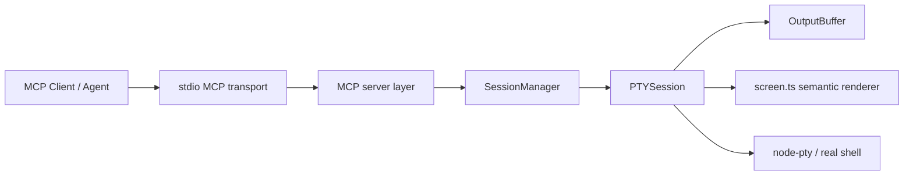

# terminalize Architecture

This document describes the **current** architecture of terminalize as shipped today.

If you only need the public MCP surface, read [./API-CONTRACT.md](./API-CONTRACT.md) and [./MCP-TOOLS.md](./MCP-TOOLS.md) first.

## System shape

terminalize is a local MCP server that gives an agent access to a **real PTY session** instead of a one-shot shell command.

At a high level:

1. an MCP client connects over **stdio**
2. terminalize creates and manages PTY-backed shell sessions
3. PTY output is buffered, analyzed, and exposed through tools/resources
4. the agent loops through write → wait/read → decide → write again

## Runtime layers

The codebase follows this runtime path:

```text
types → lib → core → server → index
```

### 1. Types

- `/absolute/path/D:/CURSOS/Proyectos/mcp-terminal-server/src/types.ts`

Shared request/response shapes, config objects, event models, and custom error classes live here.

### 2. Lib

- `/absolute/path/D:/CURSOS/Proyectos/mcp-terminal-server/src/lib/ansi-stripper.ts`
- `/absolute/path/D:/CURSOS/Proyectos/mcp-terminal-server/src/lib/shell-detector.ts`
- `/absolute/path/D:/CURSOS/Proyectos/mcp-terminal-server/src/lib/utils.ts`

These are focused helpers:

- ANSI stripping
- platform-aware shell detection
- small shared utilities

### 3. Core

- `/absolute/path/D:/CURSOS/Proyectos/mcp-terminal-server/src/core/output-buffer.ts`
- `/absolute/path/D:/CURSOS/Proyectos/mcp-terminal-server/src/core/pty-session.ts`
- `/absolute/path/D:/CURSOS/Proyectos/mcp-terminal-server/src/core/screen.ts`
- `/absolute/path/D:/CURSOS/Proyectos/mcp-terminal-server/src/core/session-manager.ts`

This is the real product core.

#### `OutputBuffer`

Responsible for:

- accumulating PTY output
- incremental reads by byte position
- `readUntil()` pattern matching
- bounded retention with FIFO trimming
- optional compaction for long-running sessions

#### `PTYSession`

Wraps `node-pty` and owns:

- one interactive shell session
- output buffering
- session metadata
- lifecycle events
- semantic screenshot generation
- signal/resize/close behavior

#### `screen.ts`

This layer converts raw PTY output into a screen model and semantic hints.

It handles:

- ANSI cursor movement and erase sequences
- save/restore cursor flows
- line-oriented rendering
- prompt detection
- TUI/editor mode classification (`vim`, `nano`, `htop`, `lazygit`, `less`, `shell`)

#### `SessionManager`

Owns the fleet of sessions:

- create/list/close sessions
- TTL cleanup
- hard max-duration enforcement
- safety policy checks for cwd and command patterns
- server-level counts and coordination

### 4. Server

- `/absolute/path/D:/CURSOS/Proyectos/mcp-terminal-server/src/server/create-terminal-server.ts`
- `/absolute/path/D:/CURSOS/Proyectos/mcp-terminal-server/src/server/tool-definitions.ts`
- `/absolute/path/D:/CURSOS/Proyectos/mcp-terminal-server/src/server/tool-handlers.ts`
- `/absolute/path/D:/CURSOS/Proyectos/mcp-terminal-server/src/server/resource-definitions.ts`
- `/absolute/path/D:/CURSOS/Proyectos/mcp-terminal-server/src/server/resource-handlers.ts`
- `/absolute/path/D:/CURSOS/Proyectos/mcp-terminal-server/src/server/shared.ts`
- `/absolute/path/D:/CURSOS/Proyectos/mcp-terminal-server/src/server.ts`

This layer adapts the core into MCP.

Responsibilities:

- register MCP tools
- register MCP resources
- translate tool calls into `SessionManager` / `PTYSession` operations
- keep the public tool contract explicit and versionable

### 5. Entry point

- `/absolute/path/D:/CURSOS/Proyectos/mcp-terminal-server/src/index.ts`

This is the executable boundary:

- parses env-based config
- starts the stdio transport
- wires the session manager + MCP server
- exposes CLI helpers like `install-skills`
- performs graceful shutdown

## MCP surface

terminalize exposes:

- **core tools** for normal agent workflows
- **advanced tools** for diagnostics/export
- **resources** for session inspection

The authoritative references are:

- [./API-CONTRACT.md](./API-CONTRACT.md)
- [./MCP-TOOLS.md](./MCP-TOOLS.md)

## Tooling split: happy path vs observability

One of the important design decisions in terminalize is that the hot path and the debug path are intentionally separated.

### Happy-path tools

Examples:

- `terminal_execute`
- `terminal_read`
- `terminal_tail`
- `terminal_screenshot`

These are optimized for:

- fewer MCP round-trips
- smaller payloads
- lower token cost

### Observability tools

Examples:

- `terminal_session_diagnostics`
- `terminal_session_export`

These are optimized for:

- debugging confusing interactive failures
- issue reports
- replay-friendly session inspection

That split keeps normal agent work cheap without sacrificing deep debugging when needed.

## Resources

The MCP server also exposes session-oriented resources such as:

- active session listing
- session buffer
- session status
- recent events
- structured session export

Resources are useful when an MCP host can inspect structured state outside the normal tool loop.

## Cross-platform model

terminalize is designed for:

- Windows (ConPTY)
- Linux
- macOS

Shell detection supports:

- `auto`
- `bash`
- `zsh`
- `pwsh`
- `cmd`

Important nuance:

- Unix-like runners still provide the deepest fully automated interactive coverage
- Windows now has stronger targeted CI coverage for PTY/session/executable/MCP-server behavior
- not every Unix interactive pattern should be expected to behave identically under ConPTY

Testing details live in [./TESTING.md](./TESTING.md).

## Safety model

terminalize does **not** try to pretend a shell is harmless.

Instead, it adds practical boundaries around a powerful primitive:

- allowed cwd roots
- allow/deny/confirm command patterns
- session TTL
- hard max session duration
- retained output caps
- explicit close/cleanup behavior

Threat-model details live in [./THREAT-MODEL.md](./THREAT-MODEL.md).

## Why the SDK is used

terminalize uses `@modelcontextprotocol/sdk` for the MCP layer.

That is a deliberate production choice:

- less protocol boilerplate
- clearer registration of tools/resources
- lower maintenance burden

The differentiation of terminalize is **not** “raw JSON-RPC from scratch.”  
It is the PTY/session/screen/agent-interop behavior above that transport layer.

## Architecture diagram



## Current maturity

As of `v0.5.1`, terminalize is no longer “just a PTY wrapper.”

It now includes:

- explicit public API contract
- semantic screen analysis
- targeted observability/export tooling
- cross-platform CI strategy
- release hardening (SBOM, checksums, attestations, trusted publishing)
- documented threat model and deployment boundaries

## Where to go next

- Public MCP contract: [./API-CONTRACT.md](./API-CONTRACT.md)
- Tool reference: [./MCP-TOOLS.md](./MCP-TOOLS.md)
- Testing/CI: [./TESTING.md](./TESTING.md)
- Security boundaries: [./THREAT-MODEL.md](./THREAT-MODEL.md)
- Docs index: [./README.md](./README.md)
