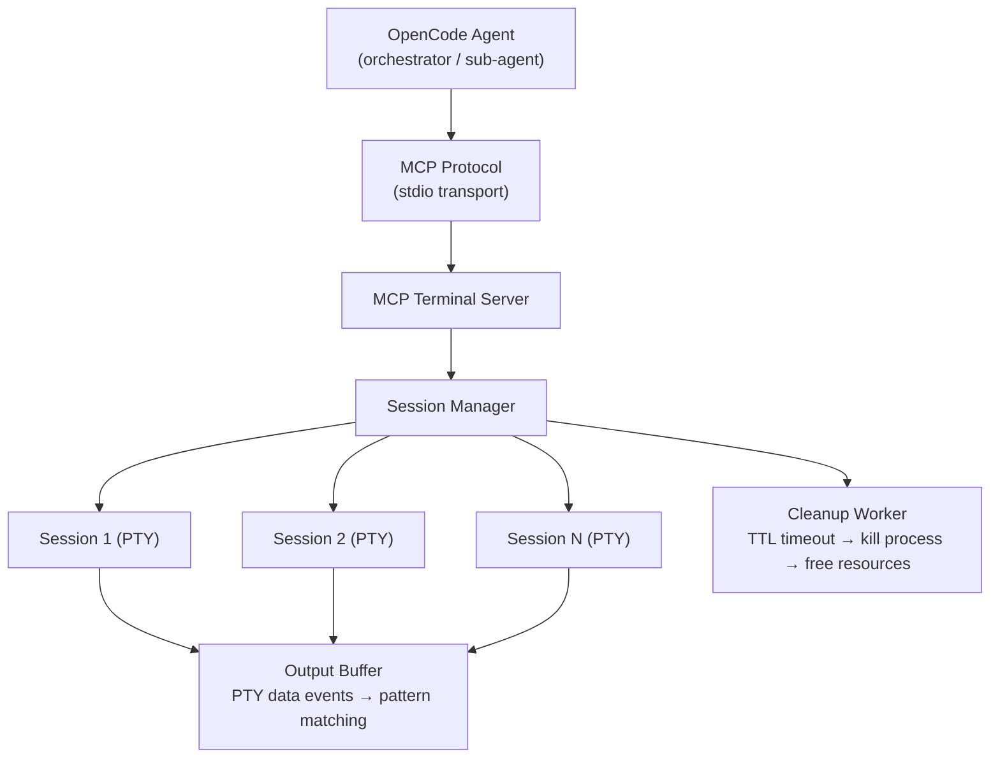
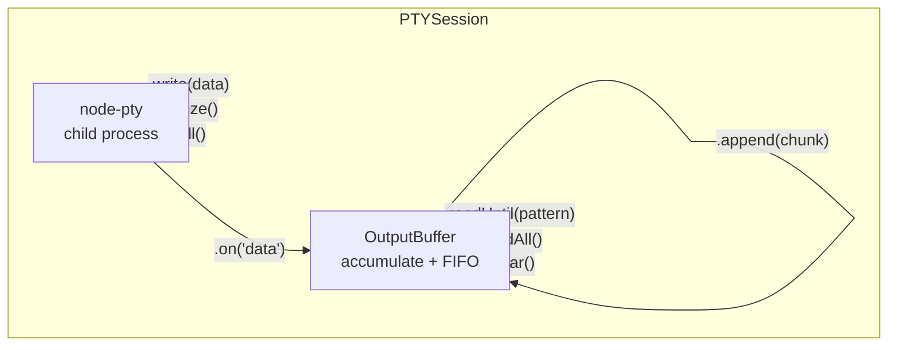

# MCP Terminal Server — Interactive Terminal for AI Agents

## Problem

The `bash` tool in OpenCode (and most AI platforms) executes commands in a **one-shot non-interactive** mode:
- Sends a command, captures stdout/stderr, returns the result.
- No real TTY, no persistent session, no open stdin.
- When a command like `npm init`, `gh pr create`, `shadcn-vue add button`, `git rebase -i`, `psql`, etc. waits for user input, the agent **cannot respond** — the command times out or the agent sees truncated output.

**Sub-agents** (such as `sdd-apply`) have even fewer tools than the orchestrator and suffer from the same problem.

## Vision

An **MCP Server** that exposes a real interactive terminal (PTY) as tools that agents can call multiple times to:

1. **Create** a persistent terminal session
2. **Write** commands and keystrokes
3. **Read** the current terminal content (screen buffer)
4. **Wait** for a specific pattern to appear (such as a prompt)
5. **Resize** the terminal if necessary
6. **Close** the session when done

The agent uses its AI model to **interpret the output**, decide what to respond, and if uncertain, ask the user with suggested options — exactly like VS Code Copilot does with "focus terminal."

## Architecture



## MCP Tools

### 1. `terminal_create_session`

Creates a new interactive terminal session.

**Input:**
```json
{
  "id": "optional-custom-id",      // auto-generated UUID if omitted
  "shell": "auto",                  // "auto" | "bash" | "zsh" | "pwsh" | "cmd"
  "cwd": "/path/to/workspace",      // working directory (default: active project)
  "cols": 80,                       // terminal columns (default: 80)
  "rows": 24,                       // terminal rows (default: 24)
  "env": {                          // additional environment variables
    "TERM": "xterm-256color"
  }
}
```

**Output:**
```json
{
  "id": "session-uuid-1234",
  "shell": "/usr/bin/zsh",
  "cwd": "/path/to/workspace",
  "cols": 80,
  "rows": 24,
  "created_at": "2026-04-30T20:00:00.000Z"
}
```

**Cross-platform shell detection (`auto` mode):**
| Platform | Preferred Shell | Fallback |
|----------|----------------|----------|
| Linux | `$SHELL` → `bash` | `sh` |
| macOS | `$SHELL` → `zsh` | `bash` |
| Windows | `pwsh.exe` | `cmd.exe` |

---

### 2. `terminal_write`

Writes text/keystrokes to the terminal.

**Input:**
```json
{
  "id": "session-uuid-1234",
  "data": "npm init\n"              // \n for Enter, \x03 for Ctrl+C, etc.
}
```

**Output:**
```json
{
  "ok": true,
  "bytes_written": 8
}
```

**Notes:**
- Supports control sequences: `\n` (Enter), `\x03` (Ctrl+C/SIGINT), `\x1b` (Escape), `\t` (Tab)
- Also supports single-character input if needed

---

### 3. `terminal_read`

Reads the current content of the terminal output buffer. Non-blocking — returns whatever has accumulated so far.

**Input:**
```json
{
  "id": "session-uuid-1234",
  "flush": true                     // if true, clears the buffer after reading
}
```

**Output:**
```json
{
  "data": "package name: (my-project) ",
  "ended": false,                   // true if the child process has terminated
  "exit_code": null                 // null if still alive, number if ended=true
}
```

---

### 4. `terminal_read_until` ⭐ (the most important)

Reads the terminal buffer **until a pattern appears** or the timeout expires. This is the key tool for interactive flows.

**Input:**
```json
{
  "id": "session-uuid-1234",
  "pattern": "package name:|version:|entry point:",  // regex patterns
  "timeout_ms": 30000,              // maximum wait timeout (default: 30000)
  "strip_ansi": true                // if true, strips ANSI codes from output
}
```

**Output:**
```json
{
  "data": "package name: (my-project) ",
  "full_output": "my-app\nversion: 1.0.0\npackage name: (my-project) ",
  "matched": "package name:",
  "ended": false,
  "exit_code": null,
  "timed_out": false
}
```

**Algorithm:**
1. Accumulate all PTY output in an internal buffer per session
2. The buffer is progressively cleared of what has already been read/delivered
3. Each `read_until` call waits until the buffer matches the regex pattern
4. If no match before the timeout, returns whatever it has with `timed_out: true`
5. `data` contains the output from the last read up to and including the match
6. `full_output` is all accumulated output since session creation (useful for debugging)

---

### 5. `terminal_resize`

Changes the terminal dimensions (useful when the agent needs to see more content).

**Input:**
```json
{
  "id": "session-uuid-1234",
  "cols": 120,
  "rows": 40
}
```

**Output:**
```json
{
  "cols": 120,
  "rows": 40
}
```

---

### 6. `terminal_list_sessions`

Lists all active sessions.

**Input:**
```json
{
  "verbose": false                  // if true, includes last N chars of buffer
}
```

**Output:**
```json
{
  "sessions": [
    {
      "id": "session-uuid-1234",
      "shell": "/usr/bin/zsh",
      "cwd": "/path/to/workspace",
      "cols": 80,
      "rows": 24,
      "created_at": "2026-04-30T20:00:00.000Z",
      "last_activity": "2026-04-30T20:05:00.000Z",
      "alive": true
    }
  ]
}
```

---

### 7. `terminal_close_session`

Closes a terminal session.

**Input:**
```json
{
  "id": "session-uuid-1234",
  "force": false                    // if true, SIGKILL instead of SIGHUP/SIGTERM
}
```

**Output:**
```json
{
  "ok": true,
  "exit_code": 0
}
```

**Behavior:**
1. Sends `SIGHUP` (followed by `SIGTERM` if it doesn't terminate within 3s)
2. If `force: true` or it doesn't terminate after SIGTERM, sends `SIGKILL`
3. Cleans up all PTY resources
4. Removes the session from the Session Manager

---

## MCP Resources (optional)

In addition to tools, the server can expose resources for the agent to inspect sessions:

- `terminal://sessions` → list of active sessions (as JSON)
- `terminal://sessions/{id}/buffer` → full buffer contents of the session
- `terminal://sessions/{id}/status` → current session status

---

## Example Flow: `npm init`

This is the typical use case that currently does not work:

```
Agent: Wants to initialize a project with npm init

Step 1: Create session
→ terminal_create_session({ cwd: "/project" })
← { id: "sess-1", cwd: "/project" }

Step 2: Write command
→ terminal_write({ id: "sess-1", data: "npm init\n" })
← { ok: true }

Step 3: Wait for first prompt
→ terminal_read_until({ id: "sess-1", pattern: "package name:", timeout_ms: 10000 })
← { data: "\r\npackage name: (my-project) ", matched: "package name:" }

Step 4: AI analyzes the prompt, decides response
→ terminal_write({ id: "sess-1", data: "my-awesome-project\n" })
← { ok: true }

Step 5: Wait for next prompt
→ terminal_read_until({ id: "sess-1", pattern: "version:|entry point:", timeout_ms: 10000 })
← { data: "\r\nversion: (1.0.0) ", matched: "version:" }

Step 6: AI decides to use default
→ terminal_write({ id: "sess-1", data: "\n" })  // Enter for default

... repeat until done ...

Step N: Verify completion
→ terminal_read_until({ id: "sess-1", pattern: "\\$ |# ", timeout_ms: 5000 })
← { data: "...", matched: "$ " }
→ Session is back at the shell prompt → command completed

Step N+1: Close session
→ terminal_close_session({ id: "sess-1" })
```

## Example Flow: `gh pr create` with editor

```
Agent: Wants to create a PR with gh pr create

Step 1: Create session
→ terminal_create_session({ cwd: "/repos/my-app" })

Step 2: Write command
→ terminal_write({ data: "gh pr create --fill\n" })

Step 3: Wait (gh can ask questions)
→ terminal_read_until({ pattern: "Choose a template|Submit|What", timeout_ms: 15000 })
← { data: "...", matched: "Submit" }

Step 4: AI sees that gh expects confirmation
→ terminal_write({ data: "\n" })  // Enter to confirm

Step 5: Wait for result
→ terminal_read_until({ pattern: "https://github.com|Error|\\$ ", timeout_ms: 20000 })
```

## Example Flow: `npx create-vite` with interactive selection

```
Agent: Wants to create a Vite project with React + TypeScript

Step 1: terminal_create_session
Step 2: terminal_write({ data: "npm create vite@latest\n" })
Step 3: terminal_read_until({ pattern: "Project name:" })
       → AI responds "my-app\n"
Step 4: terminal_read_until({ pattern: "Select a framework:" })
       → AI sees a menu, needs to choose "React"
       → terminal_write({ data: "React\n" })
Step 5: terminal_read_until({ pattern: "Select a variant:" })
       → AI sees options, chooses "TypeScript"
       → terminal_write({ data: "TypeScript\n" })
Step 6: Wait for completion
       → terminal_read_until({ pattern: "Done|\\$ ", timeout_ms: 30000 })
```

## "I Don't Know" / User Consultation Handling

When the agent is unsure about what to respond:

1. Calls `terminal_read_until` with a short timeout or `terminal_read`
2. Analyzes the output with its AI model
3. If it cannot decide, **presents the options to the user**:

```
I ran "npm init" and the terminal shows:

  package name: (my-project)
  version: (1.0.0)
  description:
  entry point: (index.js)

What values would you like to use?
A) All defaults (just press Enter)
B) Customize name: ________
C) See full output
```

The user responds, and the agent continues interacting with the terminal.

## Technical Implementation

### Recommended Stack

| Component | Technology | Reason |
|-----------|-----------|--------|
| Runtime | Node.js 22+ | User already uses Node, compatible with `node-pty` |
| MCP SDK | `@modelcontextprotocol/sdk` | Official MCP protocol SDK |
| PTY | `node-pty` | Cross-platform, battle-tested (used by VS Code) |
| Transport | stdio (local) / SSE (remote) | stdio for zero-config local setup |
| Build | TypeScript → compiled | Strong typing, same stack as the project |

### node-pty Cross-Platform

`node-pty` handles platform differences automatically:

| Platform | Backend | Notes |
|----------|---------|-------|
| **Windows 10+** | `conpty.exe` (ConPTY API) | Native since Windows 10 v1809 |
| **Windows (fallback)** | `winpty.dll` | For Windows 8/7 or restrictive environments |
| **macOS** | `forkpty()` via `util.forkpty()` | System native |
| **Linux** | `forkpty()` via `util.forkpty()` | System native |

### Installation

```bash
# Node 22+
npm install node-pty @modelcontextprotocol/sdk
pnpm add node-pty @modelcontextprotocol/sdk

# node-pty requires native compilation:
# - Windows: Visual Studio Build Tools or MSVC
# - Linux: make, gcc, python3
# - macOS: Xcode Command Line Tools
```

### Project Structure

```
packages/mcp-terminal-server/
├── package.json
├── tsconfig.json
├── src/
│   ├── index.ts              # Entry point: starts the MCP server
│   ├── server.ts             # MCP server configuration (tools, resources)
│   ├── session-manager.ts    # PTY session management (create, list, close, cleanup)
│   ├── pty-session.ts        # Wrapper around node-pty (events, buffer, pattern matching)
│   ├── output-buffer.ts      # Circular buffer with regex matching support
│   ├── shell-detector.ts     # Platform-aware shell detection (auto mode)
│   ├── ansi-stripper.ts      # Strips ANSI codes from output
│   ├── types.ts              # Shared types
│   └── utils.ts              # Utilities (timeouts, IDs, etc.)
├── test/
│   └── ...
└── README.md
```

### Internal Flow Diagram (pty-session.ts)



### Security Considerations

1. **Input sanitization**: The `data` the agent writes should be escaped appropriately. The agent could write `rm -rf /` — but that is intentional, because the agent acts on behalf of the user.
2. **Global timeout**: Each session has a maximum TTL (e.g., 30 minutes). It is automatically killed after that.
3. **Session limit**: Maximum N simultaneous sessions (configurable, default 10).
4. **Kill orphans**: If the MCP server parent process dies, child PTY processes must be cleaned up.
5. **No secret input**: The server MUST NOT be used for sensitive input (passwords, tokens) because the intermediary agent sees everything. If needed, the user should type directly.

### opencode.json Configuration

```json
{
  "mcpServers": {
    "terminal": {
      "command": "node",
      "args": ["path/to/mcp-terminal-server/dist/index.js"],
      "env": {
        "MCP_TERMINAL_MAX_SESSIONS": "10",
        "MCP_TERMINAL_SESSION_TTL_MS": "1800000"
      }
    }
  }
}
```

## Toward OpenCode Core (Future PR)

If we later want this to be native in OpenCode (without MCP), the PR should:

1. Add a new `"terminal"` tool type in the runtime protocol
2. The runtime would maintain a pool of reusable PTYs
3. Agents would have access to `terminal_read` / `terminal_write` / `terminal_read_until` as native tools
4. The runtime would handle orphan session cleanup automatically
5. Sub-agents would also have access to these tools

## Implementation Status

1. ✅ **Decision made**: MCP Server architecture with node-pty
2. ✅ **Repo/package created**: `packages/mcp-terminal-server/`
3. ✅ **Core implemented**:
   - `output-buffer.ts` with pattern matching
   - `pty-session.ts` node-pty wrapper
   - `session-manager.ts` with TTL cleanup
   - `server.ts` MCP tools
   - `index.ts` entry point
4. ⏳ **Test on 3 OS**: Windows, macOS, Linux
5. ⏳ **Create agent skill**: `interactive-terminal` skill teaching agents to use these tools correctly
6. ⏳ **Publish**: npm package + opencode.json instructions

## References

- [MCP Specification](https://spec.modelcontextprotocol.io)
- [node-pty](https://github.com/microsoft/node-pty) — Microsoft's pseudo-terminal for Node.js
- [@modelcontextprotocol/sdk](https://github.com/modelcontextprotocol/typescript-sdk)
- [VS Code Terminal API](https://code.visualstudio.com/api/extension-guides/terminal) — inspiration for PTY management
- [ConPTY (Windows)](https://devblogs.microsoft.com/commandline/windows-command-line-introducing-the-windows-pseudo-console-conpty/) — Windows Pseudo Console API
